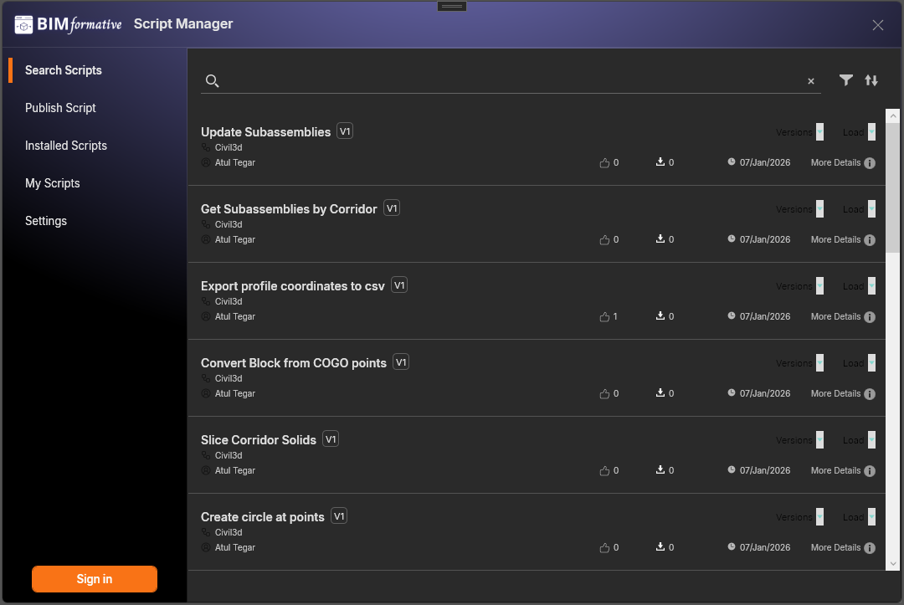

# BIMformative Dynamo Extension – Script Manager

A custom **Dynamo extension** that integrates with **BIMformative** to search, browse, and manage Dynamo scripts directly inside Dynamo.

This extension aims to provide a modern, scalable alternative to traditional script sharing by combining:
- a clean WPF UI
- a public API–driven backend
- future authentication-based workflows for loading and publishing scripts

---

## ✨ Features

### ✅ Implemented
- 🔍 **Public Script Search**
  - Live search with server-side filtering
  - Infinite / continuous scrolling
- 📜 **Script Listing**
  - Paginated API-backed results
  - Decoupled ViewModels (MVVM)
- 🧩 **Modular Tab Architecture**
  - Search
  - Publish (WIP)
  - Installed Scripts
  - My Scripts (WIP)
  - Settings
- 🌐 **HTTP API Client Layer**
  - Strongly typed DTOs
  - Cancellation-aware requests
  - Ready for authentication support

### 🚧 Planned
- 🔐 Authentication (OAuth-based)
- ⬇️ Load / Download scripts (auth-required)
- 🕒 Version history browsing
- 📖 Script details view
- 👤 User-specific scripts & publishing
- ⚠️ Offline & error state handling

---

## 🖼️ Screenshots

> 

### 🏗️ Architecture Overview

- UI Framework: WPF
- Pattern: MVVM
- HTTP Communication: HttpClient
- Backend API: BIMformative (Next.js)
- Target Environment: Dynamo Extension

Key design principles:
- ViewModels do not create services
- Single shared HttpClient
- Clear separation between UI, services, and infrastructure
- Cancellation-safe async operations

### 🚀 Getting Started (Development)

1. Clone the repository

2. Open the solution in Visual Studio

3. Ensure the BIMformative API is running locally or update BaseAddress

4. Build and load the extension in Dynamo

## 🔒 Authentication (Upcoming)

Authentication is intentionally not hardcoded into the API client.

An IAuthService abstraction is used so that:

- public endpoints work without auth

- protected actions (Load, Publish) can enforce login

- auth can be added without refactoring ViewModels

## 🤝 Contributing

Contributions, feedback, and discussions are welcome.

Planned contribution areas:

- UI/UX improvements

- Error handling & offline states

- Script versioning UX

- Authentication workflows

## 📜 License

MIT License

## 🌐 Related Projects

BIMformative Platform – Script sharing & learning for BIM developers
https://www.bimformative.com